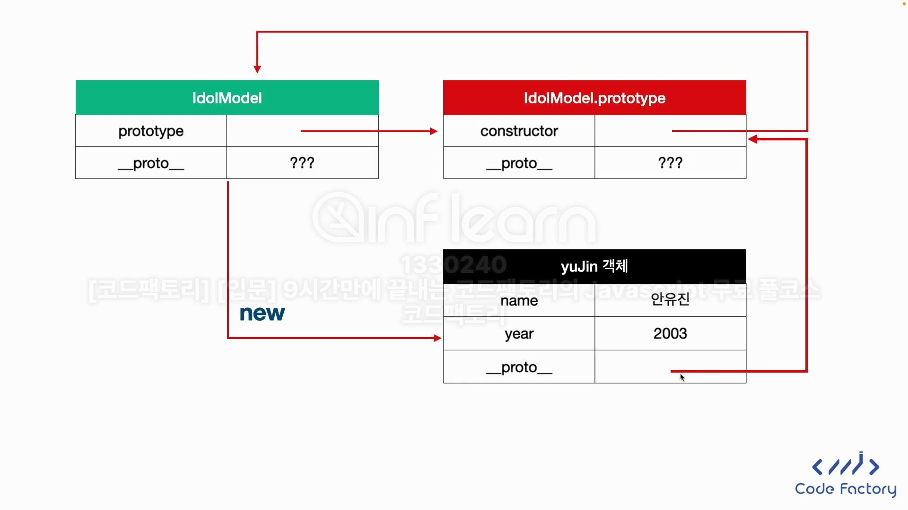

```javascript
const yuJin = 
    {
	name: '안유진',
        year: 2003
	}
```

> 📌자동으로 `__proto__` 라는 프로퍼티가 자동으로 생김(부모 클래스의 래퍼런스와 동일)



> 📌 `yuJin` 객체의 `__proto__` -> `IdolModel.prototype` 을 가르킴
> `IdolModel.protoype.constructor` -> `IdolModel` 을 가르킴
> `IdolModel.prototype` -> `IdolModel.prototype` 을 가르킴
> `new IdolModel`로 객체 생성 -> 새로 생긴 객체의 `__proto__` 프로퍼티에 
> 실제 함수의 `prototype` 값을 넣는다.


 